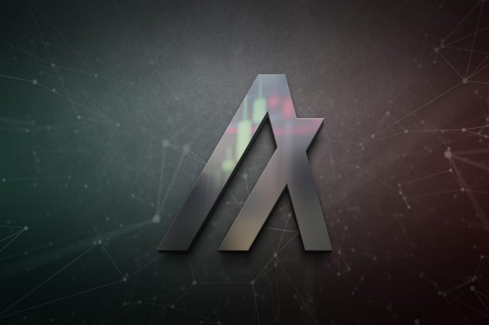

# NFT-certificate-dAPP
<p align="center">
     
</p>

## Table of Content
- [Objective](#Objective)
- [Overview](#Project-Overview)
- [Technologies-Used](#Technologies-Used)
- [Getting-Started](#Getting-Started)

## Objective
This project involves building a distributed app for 10 academy that enables their trainees to accept their weekly challenge certificate in Non-Fungible Tokens (NFT’s) using the Algorithm blockchain, and allowing trainees with NFTs to interact with a smart contract to perform predefined actions

## Overview
Web3 technology is at its core about user controlled internet. Web3 puts the power in the hands of individuals rather than corporations This is made possible by a growing stack of decentralized technologies, such as blockchains, smart contracts, oracles, crypto wallets, storage networks, etc.

## Technologies-Used
This is a [Next.js](https://nextjs.org/) project bootstrapped with [`create-next-app`](https://github.com/vercel/next.js/tree/canary/packages/create-next-app).

## Getting-Started

#### Install Sandbox

Algorand provides a docker instance for setting up a node, which can be used to get started developing quickly. To install and use this instance, follow these instructions.

```bash
git clone https://github.com/algorand/sandbox.git
cd sandbox
./sandbox up testnet
```
#### Install SDK

Algorand provides an SDK for Python which is available as a pip package. To install the Python SDK, open a terminal and run the following command:​

```bash
pip3 install py-algorand-sdk
```

Follow this link for creating an account [developer.algorand.sdk](https://developer.algorand.org/docs/sdks/python/)


#### Run the development server:

```bash
npm run dev
# or
yarn dev
```
Open [http://localhost:3000](http://localhost:3000) with your browser to see the result.
